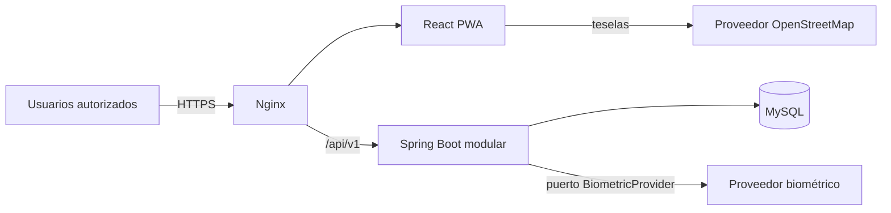
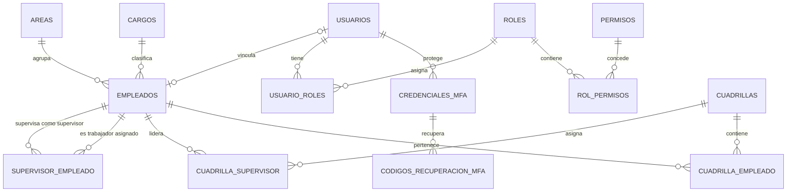
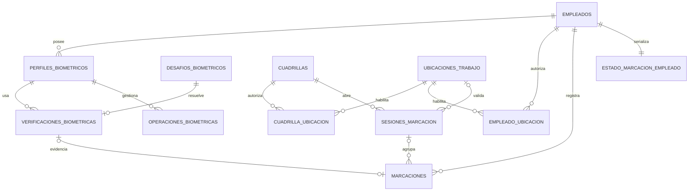
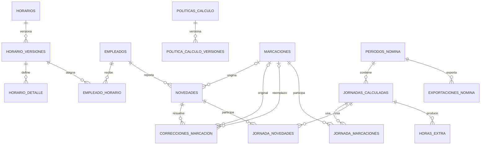
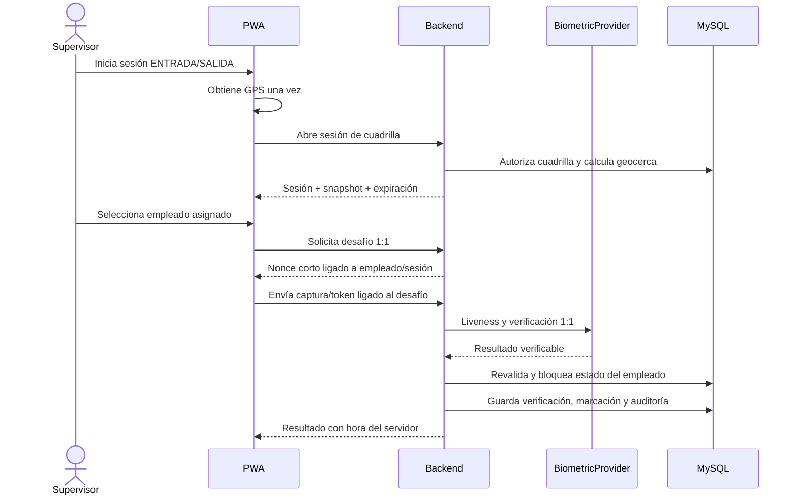

# Fase 0 — Arquitectura y modelo de datos del MVP

**Estado:** propuesta para aprobación  
**Alcance:** arquitectura, dominios, DER lógico, seguridad, riesgos y orden de implementación  
**Fuera de alcance de esta entrega:** código Spring Boot/React, migraciones, integración biométrica y despliegue

## 1. Resumen ejecutivo

La solución será un **monolito modular**: un solo backend Spring Boot desplegable, una sola aplicación React PWA y una sola base MySQL. El motor biométrico será una dependencia de infraestructura sustituible; no será dueño de empleados, marcaciones ni reglas de asistencia.



Decisiones rectoras:

1. El backend es el único sistema que autoriza, toma la hora oficial, calcula geocerca y decide si una marcación es válida.
2. Las marcaciones y verificaciones son evidencia inmutable. Las correcciones son hechos nuevos, nunca sobrescrituras silenciosas.
3. Horarios, políticas de cálculo y resultados se versionan para poder reproducir el pasado.
4. La autorización combina permiso RBAC, alcance del recurso y estado del dominio. Tener el rol `SUPERVISOR` no autoriza a operar sobre cualquier empleado.
5. La POC biométrica de Fase 3 es un **hard gate**: sin un resultado técnico y de privacidad aceptable no se integra biometría al flujo operativo.
6. No se codifican reglas laborales colombianas ni columnas Orión hasta que RRHH entregue las reglas y la plantilla reales.

### 1.1 No alcance del MVP

Quedan expresamente fuera: nómina completa, vacaciones, incapacidades completas, selección de personal, tracking GPS continuo, Traccar, apps Android/iOS nativas, marcación offline, microservicios, Kubernetes, integración automática con Orión y desarrollo propio de algoritmos de reconocimiento facial/liveness.

## 2. Arquitectura definitiva propuesta

### 2.1 Estilo

- Un repositorio y un producto desplegable.
- Un backend Spring Boot; no habrá microservicios de negocio.
- Un proyecto Maven inicialmente, organizado por dominio y con fronteras verificadas mediante pruebas de arquitectura.
- Una base MySQL con claves foráneas y migraciones Flyway globalmente ordenadas.
- API REST versionada en `/api/v1`.
- DTOs de entrada/salida; nunca se exponen entidades JPA.
- Transacciones en servicios de aplicación, cortas y explícitas.
- Dependencias entre dominios solo mediante APIs/puertos públicos; ningún módulo usa repositories internos de otro.
- Referencias entre agregados mediante IDs. MySQL conserva las FKs, pero no se crean grafos JPA bidireccionales entre módulos.
- Eventos internos solo cuando desacoplan efectos secundarios. No se introduce un bus distribuido ni una infraestructura de microservicios.

### 2.2 Estructura interna por dominio

Para dominios con lógica relevante:

```text
<dominio>/
  api/
    controller/
    dto/
  application/
    service/
    mapper/
    port/
  domain/
    entity/
    valueobject/
    policy/
    event/
    exception/
  infrastructure/
    persistence/
      repository/
      mapper/
    client/
    configuration/
```

Los catálogos simples pueden usar una variante más plana (`controller`, `service`, `repository`, `dto`, `entity`, `mapper`, `exception`) dentro de su propio dominio. No existirán carpetas globales de controllers, servicios o repositories.

### 2.3 Módulos Spring Boot

| Módulo | Responsabilidad exclusiva |
|---|---|
| `shared` | Reloj del sistema, correlación, paginación, errores API y tipos técnicos mínimos. No contiene reglas de negocio. |
| `auth` | Login, logout, sesiones, CSRF, principal autenticado y políticas de autenticación. |
| `usuarios` | Credenciales, estado, vínculo opcional con empleado y asignación histórica de roles. |
| `roles` | Roles, permisos y matriz rol-permiso. |
| `areas` | Catálogo de áreas. |
| `cargos` | Catálogo de cargos. |
| `empleados` | Identidad laboral y estado del empleado. |
| `supervisores` | Asignación histórica supervisor-empleado y políticas de alcance. |
| `cuadrillas` | Agrupaciones operativas y membresías históricas. |
| `biometria` | Perfiles, desafíos, enrolamiento, verificación 1:1, liveness y puerto `BiometricProvider`. |
| `ubicaciones` | Sitios de trabajo, asignaciones, geocerca y cálculo de distancia en backend. |
| `horarios` | Horarios versionados, detalle semanal y asignaciones efectivas. |
| `marcaciones` | Sesiones de cuadrilla, secuencia entrada/salida, idempotencia y evidencia de marcación. |
| `novedades` | Solicitudes, revisión y correcciones administrativas append-only. |
| `jornadas` | Motor determinista que transforma marcaciones, horario, política y novedades en resultados versionados. |
| `horasextra` | Desglose derivado de minutos extra por concepto. |
| `periodos` | Ciclo ABIERTO → EN_REVISION → CERRADO y protocolo de congelación. |
| `reportes` | Consultas y exportadores; `OrionExcelExporter` será un adaptador versionado. |
| `auditoria` | Registro append-only de acciones, resultados, actor, IP, correlación y cambios permitidos. |

### 2.4 Dependencias permitidas

`A → B` significa que `A` puede consumir únicamente la API pública de `B`.

```text
auth          → usuarios, roles, auditoria.api
roles         → auditoria.api
usuarios      → roles, auditoria.api
empleados     → areas, cargos, auditoria.api
supervisores  → empleados, auditoria.api
cuadrillas    → empleados, supervisores, auditoria.api
biometria     → empleados, auditoria.api
horarios      → empleados, auditoria.api
ubicaciones   → empleados, cuadrillas, auditoria.api
marcaciones   → empleados, supervisores, biometria, ubicaciones,
                periodos, auditoria.api
novedades     → empleados, marcaciones, periodos, auditoria.api
jornadas      → empleados, marcaciones, horarios, novedades, periodos,
                auditoria.api
horasextra    → jornadas, periodos, auditoria.api
periodos      → auditoria.api
reportes      → APIs de consulta de empleados, jornadas, horasextra y periodos;
                auditoria.api
auditoria     → shared
```

Para evitar un ciclo durante el cierre, `periodos` publicará un contrato `CierrePeriodoParticipant`; jornadas y horas extra participarán sin que períodos conozca sus implementaciones.
La lista describe la arquitectura objetivo. Como el flujo completo de períodos llega en Fase 8, marcaciones y jornadas definen desde antes un puerto de mutabilidad; hasta entonces no existen períodos cerrados. En Fase 8 se crea `periodos_nomina`, se backfillean las jornadas por fecha, se añade la FK no nula y se conecta la política real. Así se conserva el orden de fases sin fingir que un período ya existe.

Reglas de frontera:

- controllers solo llaman casos de uso de su módulo;
- los repositories no salen de su módulo;
- `shared` no se convierte en un depósito de utilidades de negocio;
- Apache POI existe solamente en `reportes`;
- los clientes de proveedores concretos existen solamente en `biometria.infrastructure.client`;
- pruebas de ArchUnit y/o Spring Modulith harán fallar el build si se rompe una frontera.

## 3. Estructura propuesta del repositorio

```text
asiscontrol/
  backend/
    pom.xml
    mvnw
    mvnw.cmd
    src/main/java/com/empresa/asistencia/
      auth/
      usuarios/
      roles/
      empleados/
      areas/
      cargos/
      supervisores/
      cuadrillas/
      biometria/
      ubicaciones/
      horarios/
      marcaciones/
      jornadas/
      novedades/
      horasextra/
      periodos/
      reportes/
      auditoria/
      shared/
    src/main/resources/
      db/migration/
      application.yml
      application-development.yml
      application-test.yml
      application-production.yml
    src/test/
  frontend/
    src/
      app/
      features/
      layouts/
      shared/
      pwa/
    public/
  infrastructure/
    nginx/
    docker/
    scripts/
  docs/
    architecture/
    adr/
    data-model/
    api/
    security/
    biometric-poc/
    runbooks/
  docker-compose.yml
  docker-compose.development.yml
  docker-compose.production.yml
  .env.example
  README.md
```

No se crearán estos archivos de una vez. Se incorporarán únicamente cuando la fase que los necesita empiece.

### 3.1 Arquitectura de navegación frontend

Se conserva el mapa solicitado:

```text
/login
/admin/*
/rrhh/*
/supervisor/cuadrilla
/supervisor/marcaciones
/conductor/marcacion
/conductor/historial
```

Cada área tendrá un layout y menú propios. Los route guards evitan navegación accidental, pero son solo UX: toda autorización vuelve a ejecutarse en backend. La pantalla del supervisor se diseña mobile-first; la PWA será instalable, pero no almacenará ni enviará marcaciones offline.

## 4. Convenciones técnicas y de datos

### 4.1 Persistencia

- PK internas: `BIGINT`; los IDs no son secretos y la autorización nunca depende de que sean difíciles de adivinar.
- Claves externas/idempotencia/desafíos: UUID aleatorio.
- Tablas y columnas: `snake_case`; Java: nombres claros en español de dominio o una convención inglesa acordada, sin mezclarlos dentro del mismo concepto.
- Fechas técnicas: `DATETIME(6)` en UTC y Java `Instant`.
- Fechas civiles: `DATE`; horas de horario: `TIME`.
- Zona de negocio inicial: `America/Bogota`, explícita y configurable. Nunca se usa la zona del navegador como fuente de verdad.
- Enums persistidos como texto, nunca por ordinal Java ni como `ENUM` propietario de MySQL.
- Coordenadas: latitud `DECIMAL(9,7)`, longitud `DECIMAL(10,7)`; precisión, radio y distancia `DECIMAL(10,2)`.
- Tablas mutables: `created_at`, `updated_at` y `version` para bloqueo optimista; actor de creación/modificación donde aporte trazabilidad.
- Evidencia inmutable: `created_at`, sin actualización de su carga útil.
- FKs con `ON DELETE RESTRICT`; no habrá borrado en cascada de datos de negocio.
- JSON solo para auditoría allowlist y configuración versionada; no para relaciones o campos operativos centrales.
- `spring.jpa.hibernate.ddl-auto=validate`; Flyway es el único propietario del esquema.
- Una migración aplicada nunca se modifica; una corrección crea una migración nueva.

### 4.2 API

- Base `/api/v1` y recursos en plural.
- Errores con Problem Details (`application/problem+json`) y códigos de negocio estables.
- Bean Validation en DTOs y validaciones de invariantes en servicios/políticas de dominio.
- Paginación y orden explícitos en listados.
- `Idempotency-Key` obligatorio en creación de marcaciones y apertura de sesión.
- La API no acepta hora oficial, rol, supervisor efectivo, resultado facial, liveness ni `dentroGeocerca` calculados por el cliente.
- El backend obtiene tiempo mediante un `Clock` inyectable para que los tests sean deterministas.

### 4.3 Datos derivados que no se duplican en `empleados`

- `nombreCompleto`: se calcula desde nombres y apellidos.
- `supervisor`: se obtiene de la asignación vigente.
- `horarioAsignado`: se obtiene de `empleado_horario` vigente.
- `biometriaRegistrada`: se deriva de la existencia de un perfil activo.

## 5. DER lógico propuesto

El DER se divide en tres vistas para mantenerlo legible. Las tablas puente históricas incluyen vigencia; las cardinalidades representan la estructura, no todas las reglas temporales.

### 5.1 Identidad y estructura laboral



### 5.2 Biometría, ubicación y marcaciones



### 5.3 Horarios, correcciones, jornadas y períodos



## 6. Catálogo de entidades del MVP

Los campos de auditoría estándar indicados en la sección 4 no se repiten en cada fila.

### 6.1 Identidad y autorización

| Entidad | Campos principales | Relaciones e invariantes |
|---|---|---|
| `usuarios` | `empleado_id?`, `nombre_usuario`, `nombre_usuario_normalizado`, `email?`, `password_hash`, `estado`, `intentos_fallidos`, `bloqueado_hasta?`, `debe_cambiar_password`, `credenciales_actualizadas_at`, `auth_version`, `ultimo_login_at?` | `nombre_usuario_normalizado` único; `empleado_id` único y opcional. SUPERVISOR y CONDUCTOR que acceden deben vincularse a un empleado. Cambios de seguridad incrementan `auth_version`. |
| `roles` | `codigo`, `nombre`, `descripcion`, `es_sistema`, `estado` | Códigos iniciales protegidos: `SUPER_ADMIN`, `RRHH`, `SUPERVISOR`, `CONDUCTOR`. |
| `permisos` | `codigo`, `modulo`, `descripcion` | Catálogo técnico estable. |
| `usuario_roles` | `usuario_id`, `rol_id`, `vigente_desde`, `vigente_hasta?`, `asignado_por`, `revocado_por?` | No se borra al revocar; una asignación vigente por usuario/rol. |
| `rol_permisos` | `rol_id`, `permiso_id` | Par único. Los roles base se cargan por migración y su matriz no se edita desde UI en el MVP. |
| `credenciales_mfa` | `usuario_id`, `tipo`, `secreto_cifrado`, `clave_cifrado_version`, `estado`, `confirmada_at?`, `revocada_at?`, `ultimo_paso_totp_usado?` | TOTP para cuentas privilegiadas; secreto cifrado con clave externa a la BD, rotación versionada y protección contra replay. |
| `codigos_recuperacion_mfa` | `credencial_mfa_id`, `codigo_hash`, `usado_at?` | Códigos aleatorios de un solo uso, nunca almacenados en claro. |

Las tablas técnicas de Spring Session se administrarán con Flyway pero no son entidades de negocio.
La migración de Fase 1 crea `usuarios` sin la FK a empleados; Fase 2 añade `empleado_id` y su restricción cuando exista `empleados`. No se crean cuentas SUPERVISOR/CONDUCTOR operativas antes de esa migración.

### 6.2 Personas y organización

| Entidad | Campos principales | Relaciones e invariantes |
|---|---|---|
| `areas` | `codigo`, `nombre`, `descripcion?`, `estado` | Código único; se desactiva, no se elimina si está usada. |
| `cargos` | `codigo`, `nombre`, `descripcion?`, `estado` | Código único; se desactiva, no se elimina si está usado. |
| `empleados` | `tipo_documento`, `numero_documento_normalizado`, `nombres`, `apellidos`, `codigo_empleado`, `area_id`, `cargo_id`, `tipo_empleado`, `estado`, `fecha_ingreso`, `fecha_inactivacion?`, `motivo_inactivacion?` | Únicos `(tipo_documento, numero_documento_normalizado)` y `codigo_empleado`. Tipo laboral y rol de acceso son conceptos separados. |
| `supervisor_empleado` | `supervisor_id`, `empleado_id`, `vigente_desde`, `vigente_hasta?`, `asignado_por`, `motivo_cambio?` | Fuente autoritativa de alcance. Supervisor distinto del trabajador, de tipo `SUPERVISOR`; un supervisor vigente por empleado y sin intervalos solapados. |
| `cuadrillas` | `codigo`, `nombre`, `descripcion?`, `estado` | Identidad estable de la agrupación; código único. |
| `cuadrilla_supervisor` | `cuadrilla_id`, `supervisor_id`, `vigente_desde`, `vigente_hasta?`, `asignado_por` | Conserva el historial de liderazgo; máximo un supervisor vigente por cuadrilla y sin solapamientos. |
| `cuadrilla_empleado` | `cuadrilla_id`, `empleado_id`, `vigente_desde`, `vigente_hasta?`, `asignado_por` | Para el MVP, máximo una cuadrilla vigente por empleado. Debe coincidir con su supervisor vigente. No es fuente de autorización. |

Si área/cargo deben reconstruirse históricamente para Orión se añadirá `empleado_adscripcion` versionada cuando la plantilla confirme esa necesidad; no se inventa todavía.

### 6.3 Biometría

| Entidad | Campos principales | Relaciones e invariantes |
|---|---|---|
| `perfiles_biometricos` | `empleado_id`, `provider_code`, `provider_profile_id`, `estado`, `calidad_enrolamiento?`, `fecha_enrolamiento`, `enrolado_por`, datos de revocación/eliminación | Estados `ACTIVO`, `REVOCADO`, `PENDIENTE_ELIMINACION`, `ELIMINADO`, `ERROR_ELIMINACION`. Un perfil activo por empleado; `(provider_code, provider_profile_id)` único. Re-enrolar crea una fila nueva y revoca la anterior. No guarda imagen ni embedding. |
| `desafios_biometricos` | `nonce_hash`, `proposito`, `empleado_esperado_id`, `usuario_solicitante_id`, `contexto_operacion_id?`, `expira_at`, `iniciado_at?`, `usado_at?`, `estado` | Corto, de un solo uso y ligado a actor, empleado y una referencia UUID opaca de contexto; no crea FK ni dependencia hacia marcaciones. Estados `PENDIENTE`, `EN_PROCESO`, `USADO`, `EXPIRADO`. |
| `verificaciones_biometricas` | `desafio_id`, `perfil_id`, `empleado_esperado_id`, `provider_code`, `provider_transaction_id?`, `liveness_valido`, `liveness_score?`, `biometria_valida`, `similaridad?`, `umbral_aplicado?`, `resultado`, `model_version?`, `fecha_hora_servidor`, `codigo_error?` | Evidencia inmutable. No persiste respuesta cruda del proveedor. Transaction ID único cuando exista. |
| `operaciones_biometricas` | `perfil_id`, `tipo`, `idempotency_key`, `estado`, `intentos`, `proximo_intento_at?`, `ultimo_error_codigo?`, `completada_at?` | Registro durable para eliminación/reconciliación. Permite resolver fallos parciales sin afirmar falsamente que el proveedor borró el perfil. |

`BiometricProvider` expondrá resultados neutrales para `enroll`, `verify`, `checkLiveness` y `deleteProfile`. Ninguna implementación concreta conocerá JPA de empleados o marcaciones. El consumo del desafío se reclama atómicamente (`PENDIENTE → EN_PROCESO`) antes de invocar al proveedor; un fallo obliga a emitir un desafío nuevo y nunca permite dos verificaciones para el mismo desafío.

La eliminación usa una saga local idempotente: en una transacción se marca `PENDIENTE_ELIMINACION` y se crea la operación durable; un worker invoca al proveedor; solo con confirmación cambia a `ELIMINADO`. Un timeout/fallo pasa a `ERROR_ELIMINACION` y se reintenta con backoff. Si el proveedor ya no encuentra el perfil, el resultado se considera idempotentemente eliminado y se reconcilia con auditoría.

### 6.4 Ubicaciones y geocerca

| Entidad | Campos principales | Relaciones e invariantes |
|---|---|---|
| `ubicaciones_trabajo` | `nombre`, `descripcion?`, `latitud`, `longitud`, `radio_metros`, `modo_geocerca`, `estado` | `modo_geocerca`: `OBLIGATORIA`, `SOLO_EVIDENCIA`, `DESACTIVADA`. Sustituye al booleano ambiguo `requiereGeocerca`. |
| `cuadrilla_ubicacion` | `cuadrilla_id`, `ubicacion_id`, `vigente_desde`, `vigente_hasta?`, `asignado_por` | Define ubicaciones que una cuadrilla puede seleccionar; relación histórica. |
| `empleado_ubicacion` | `empleado_id`, `ubicacion_id`, `vigente_desde`, `vigente_hasta?`, `asignado_por` | Principalmente para marcación individual de conductores; relación histórica. |

La distancia se calcula en backend con fórmula geodésica probada. El GPS del navegador es evidencia manipulable: la geocerca reduce errores operativos, no demuestra identidad ni evita por sí sola el spoofing.

Precedencia de autorización: una sesión con cuadrilla usa `cuadrilla_ubicacion`; una sesión sin cuadrilla usa las ubicaciones asignadas al empleado supervisor; una marcación individual usa `empleado_ubicacion` del conductor. No se mezclan por unión o intersección implícita.

### 6.5 Sesiones y marcaciones

| Entidad | Campos principales | Relaciones e invariantes |
|---|---|---|
| `sesiones_marcacion` | `cuadrilla_id?`, `cuadrilla_supervisor_id?`, `supervisor_id`, `creada_por_usuario_id`, `tipo`, `fecha_hora_inicio`, `fecha_hora_cierre?`, GPS, `ubicacion_trabajo_id?`, snapshot de centro/radio/modo/distancia/resultado, `estado`, `idempotency_key`, `request_hash`, `cerrada_por?` | `ABIERTA`, `CERRADA`, `CANCELADA`, `EXPIRADA`. GPS y geocerca quedan fijos al abrir. Solo acepta marcaciones del mismo tipo y supervisor mientras esté vigente. Puede agrupar una cuadrilla o los asignados directos del supervisor. |
| `estado_marcacion_empleado` | `empleado_id`, `entrada_abierta_id?`, `ultima_marcacion_aceptada_id?`, `version` | Ancla técnica bloqueable para serializar intentos concurrentes. Se puede reconstruir desde evidencia, pero evita dos entradas abiertas. |
| `marcaciones` | `empleado_id`, `tipo`, `fecha_hora_servidor`, `fecha_hora_efectiva`, `origen`, `registrada_por_usuario_id`, `supervisor_id?`, `supervisor_empleado_id?`, `sesion_marcacion_id?`, GPS y snapshot de geocerca, `metodo_identificacion`, `verificacion_biometrica_id?`, `estado_original`, `motivo_rechazo?`, `idempotency_key`, `request_hash` | Evidencia inmutable. Estados originales: `VALIDA`, `RECHAZADA`, `EXCEPCIONAL`. Una facial aceptada usa hora efectiva igual a hora servidor; una excepción puede registrar hora efectiva pasada, siempre mediante novedad aprobada. |

La API puede mostrar `ANULADA_LOGICAMENTE` como **estado efectivo** cuando existe una corrección de anulación. La fila original no se muta. Las rechazadas permanecen como evidencia, pero no cambian la secuencia entrada/salida ni entran al cálculo.

Para una marcación de sesión, se copian las coordenadas y el snapshot de geocerca de la sesión. Esta duplicación es deliberada: congela la evidencia. Para conductor, sesión y supervisor son nulos y el usuario actor debe estar vinculado al mismo empleado.

La idempotencia se liga a actor, operación y hash canónico del request. Reusar una clave con el mismo hash devuelve el resultado previo; reutilizarla con contenido distinto se rechaza como conflicto.

### 6.6 Horarios y reglas

| Entidad | Campos principales | Relaciones e invariantes |
|---|---|---|
| `horarios` | `codigo`, `nombre`, `descripcion?`, `estado` | Cabecera estable; código único. |
| `horario_versiones` | `horario_id`, `numero_version`, `vigente_desde`, `vigente_hasta?`, `estado`, `zona_horaria`, `publicado_por` | `BORRADOR`, `PUBLICADO`, `RETIRADO`. Una versión publicada no se edita. |
| `horario_detalle` | `horario_version_id`, `dia_semana`, `secuencia`, `hora_inicio`, `hora_fin`, `termina_dia_siguiente`, `duracion_descanso_minutos`, tolerancias, `activo` | Par `(versión, día, secuencia)` único. `secuencia` permite turnos partidos futuros. |
| `empleado_horario` | `empleado_id`, `horario_version_id`, `vigente_desde`, `vigente_hasta?`, `asignado_por` | Un horario vigente por empleado y sin solapamientos. |
| `politicas_calculo` | `codigo`, `nombre`, `descripcion?`, `estado` | Cabecera de una política empresarial, no una ley codificada. |
| `politica_calculo_versiones` | `politica_id`, `numero_version`, `schema_version`, `configuracion_json`, `checksum`, vigencias, `estado`, `publicado_por` | JSON validado contra esquema tipado/versionado. Una versión publicada es inmutable. Los parámetros se definen con RRHH en Fase 6. |

Para el MVP existirá una sola política publicada vigente para toda la empresa en cada fecha; los intervalos no pueden solaparse. La jornada guarda la versión exacta aplicada. Si en el futuro hay poblaciones con políticas distintas se añadirá una asignación efectiva explícita, no una selección implícita.

No se implantará un motor de reglas genérico. El cálculo será código de dominio determinista con configuración versionada y tipos explícitos.

### 6.7 Novedades y correcciones

| Entidad | Campos principales | Relaciones e invariantes |
|---|---|---|
| `novedades` | `empleado_id`, `periodo_nomina_id?`, `marcacion_objetivo_id?`, `fecha`, `tipo`, `descripcion`, `tipo_marcacion_solicitada?`, `fecha_hora_solicitada?`, `creado_por`, `estado`, datos de revisión | `PENDIENTE`, `APROBADA`, `RECHAZADA`. Fecha, tipo y marca objetivo evitan la ambigüedad de guardar solo `horaSolicitada`. |
| `correcciones_marcacion` | `novedad_id`, `correccion_anterior_id?`, `secuencia`, `tipo`, `marcacion_original_id?`, `marcacion_reemplazo_id?`, `valor_anterior_json?`, `valor_nuevo_json?`, `motivo`, `aplicada_por`, `aplicada_at` | `CREAR_FALTANTE`, `REEMPLAZAR`, `ANULAR`, `REVERSAR`. `novedad_id` y `correccion_anterior_id` son únicos. Se agrega solo sobre la cabeza vigente de una cadena lineal; no se permiten ramas. |

`REEMPLAZAR` conserva la original y crea una marcación `EXCEPCIONAL`. `ANULAR` deja la original intacta y cambia únicamente la interpretación efectiva mediante la corrección. `REVERSAR` apunta a la corrección vigente y restablece el estado anterior sin modificarla.

Checks estructurales:

- `CREAR_FALTANTE`: original nula y reemplazo excepcional presente;
- `REEMPLAZAR`: original y reemplazo excepcional presentes, del mismo empleado;
- `ANULAR`: original presente y reemplazo nulo;
- `REVERSAR`: `correccion_anterior_id` presente y consistente con el mismo empleado.

Al aplicar cualquier corrección se bloquea `estado_marcacion_empleado`, se reconstruye la secuencia efectiva completa y se actualiza esa proyección dentro de la misma transacción. Dos correcciones concurrentes sobre la misma cabeza no pueden aplicarse.

### 6.8 Períodos, jornadas y horas extra

| Entidad | Campos principales | Relaciones e invariantes |
|---|---|---|
| `periodos_nomina` | `fecha_inicio`, `fecha_fin`, `estado`, datos de inicio de revisión/cierre, `snapshot_checksum?` | Intervalos no solapados; transición `ABIERTO → EN_REVISION → CERRADO`. Cerrado es inmutable en el MVP. |
| `jornadas_calculadas` | `empleado_id`, `periodo_nomina_id`, `fecha_jornada`, `version_calculo`, `es_actual`, referencias al horario/política exactos, tiempos efectivos, todos los minutos requeridos, `estado_jornada`, `engine_version`, `input_hash`, `calculada_at`, `finalizada_at?` | En el esquema objetivo `periodo_nomina_id` es obligatorio; Fase 6 nace sin esa columna y Fase 8 la añade tras backfill. Desde entonces el período debe existir antes de calcular. Versiones previas no se borran y solo una es actual por empleado/fecha. |
| `jornada_marcaciones` | `jornada_calculada_id`, `marcacion_id`, `rol_fuente`, `fecha_hora_efectiva_aplicada` | Hace reproducible qué evidencia participó y cómo. |
| `jornada_novedades` | `jornada_calculada_id`, `novedad_id`, `efecto_aplicado` | Hace reproducible la incidencia de una novedad. |
| `horas_extra` | `jornada_calculada_id`, `minutos_extra`, `codigo_concepto`, `estado` | Una fila única por `(jornada_calculada_id, codigo_concepto)`. Empleado, fecha y período se obtienen de la jornada para evitar datos divergentes. El concepto inicial neutral será `EXTRA_TOTAL`. |
| `exportaciones_nomina` | `periodo_nomina_id`, `tipo`, `template_version`, `nombre_archivo`, `storage_reference?`, `sha256`, `cantidad_registros`, `estado`, `generada_por`, `generada_at`, `mensaje_error?` | Registra reproducibilidad sin inventar las columnas Orión. El archivo puede generarse en streaming y conservar solo metadatos según retención. |

### 6.9 Auditoría

| Entidad | Campos principales | Relaciones e invariantes |
|---|---|---|
| `auditoria` | `usuario_id?`, `identificador_actor?`, `roles_contexto?`, `accion`, `entidad_tipo`, `entidad_id?`, `fecha_hora`, `ip`, `user_agent_limitado?`, `correlation_id`, `resultado`, `codigo_motivo?`, `datos_antes_json?`, `datos_despues_json?`, `datos_contexto_json?` | Append-only y sin endpoints de actualización/borrado. JSON con lista blanca; nunca secretos, tokens, hashes de contraseña, imágenes, embeddings o payload biométrico crudo. |

Los cambios de dominio y su auditoría se guardan en la misma transacción cuando sea posible. Login fallido, acceso denegado y fallas externas se auditan en una transacción independiente y corta.
El usuario runtime no tendrá privilegios `UPDATE`/`DELETE` sobre `auditoria`, `marcaciones` ni `verificaciones_biometricas`; la retención se ejecutará por un proceso administrativo separado y controlado cuando la política lo autorice.

Acciones mínimas del catálogo de auditoría:

```text
LOGIN, LOGOUT, ACCESO_DENEGADO
CREAR_USUARIO, MODIFICAR_USUARIO, DESACTIVAR_USUARIO, ASIGNAR_ROL, REVOCAR_ROL
CREAR_EMPLEADO, MODIFICAR_EMPLEADO, DESACTIVAR_EMPLEADO
ASIGNAR_SUPERVISOR, CERRAR_ASIGNACION_SUPERVISOR
ENROLAR_BIOMETRIA, REENROLAR_BIOMETRIA, ELIMINAR_BIOMETRIA
ABRIR_SESION_MARCACION, CERRAR_SESION_MARCACION
CREAR_MARCACION, MARCACION_RECHAZADA, MARCACION_EXCEPCIONAL
CREAR_NOVEDAD, APROBAR_NOVEDAD, RECHAZAR_NOVEDAD, APLICAR_CORRECCION
CREAR_HORARIO, MODIFICAR_HORARIO, PUBLICAR_HORARIO
ABRIR_PERIODO, INICIAR_REVISION_PERIODO, CERRAR_PERIODO
EXPORTAR_ORION
```

`LOGIN` usa el campo `resultado` para distinguir éxito/fallo y evita dos taxonomías incompatibles. El catálogo crecerá por migración y no mediante texto libre.

## 7. Índices y restricciones esenciales

Además de todos los índices de FK:

- `usuarios(nombre_usuario_normalizado)` único.
- `usuarios(empleado_id)` único cuando no sea nulo.
- `empleados(tipo_documento, numero_documento_normalizado)` único.
- `empleados(codigo_empleado)` único.
- `empleados(estado, tipo_empleado)`.
- asignaciones por `(empleado_id, vigente_hasta)` y `(supervisor_id, vigente_hasta)`.
- una asignación vigente de supervisor, cuadrilla, horario y perfil biométrico por empleado. En MySQL se resolverá con columna generada + índice único para la fila abierta, además de validación transaccional.
- `desafios_biometricos(nonce_hash)` único y consumo mediante actualización condicional/lock.
- `verificaciones_biometricas(desafio_id)` único.
- `verificaciones_biometricas(provider_code, provider_transaction_id)` único cuando el proveedor entregue ID.
- `sesiones_marcacion(supervisor_id, estado, fecha_hora_inicio)`.
- `sesiones_marcacion(creada_por_usuario_id, idempotency_key)` único.
- `marcaciones(registrada_por_usuario_id, idempotency_key)` único.
- `marcaciones(verificacion_biometrica_id)` único cuando no sea nulo.
- `marcaciones(empleado_id, fecha_hora_efectiva)`.
- `marcaciones(sesion_marcacion_id, fecha_hora_servidor)`.
- `novedades(estado, fecha)` y `(empleado_id, fecha)`.
- `correcciones_marcacion(novedad_id)` único, `correcciones_marcacion(correccion_anterior_id)` único y `correcciones_marcacion(marcacion_reemplazo_id)` único cuando no sea nulo.
- `jornadas_calculadas(empleado_id, fecha_jornada, version_calculo)` único.
- una única jornada `es_actual=true` por empleado/fecha, mediante columna generada + índice único condicional.
- `jornadas_calculadas(periodo_nomina_id, estado_jornada)`.
- `horas_extra(jornada_calculada_id, codigo_concepto)` único.
- `auditoria(usuario_id, fecha_hora)`, `(entidad_tipo, entidad_id, fecha_hora)` y `(accion, fecha_hora)`.

MySQL no tiene una restricción de exclusión temporal general. Los intervalos no solapados se validarán bloqueando siempre una fila padre estable —empleado para sus asignaciones y una fila de control para períodos— antes de consultar/insertar, incluso cuando todavía no exista ningún intervalo. Se cubrirá con pruebas de concurrencia.

## 8. Invariantes críticas

1. Un empleado inactivo no puede generar una marcación normal.
2. Supervisor y conductor deben tener usuario activo vinculado a su empleado.
3. Un usuario con rol SUPERVISOR debe vincularse a un empleado de tipo `SUPERVISOR`; uno con rol CONDUCTOR, a tipo `CONDUCTOR`. Las combinaciones de roles se deniegan por defecto salvo aprobación explícita.
4. Siempre debe quedar al menos un `SUPER_ADMIN` activo; no puede revocarse o desactivarse el último.
5. Un supervisor solo lista y marca empleados con asignación vigente; la consulta ya incluye ese filtro para prevenir IDOR.
6. Cuadrilla es agrupación operativa; `supervisor_empleado` es la fuente de autorización.
7. El conductor solo opera sobre el `empleado_id` ligado a su principal autenticado.
8. El request normal no contiene hora efectiva; el backend usa su `Clock`.
9. Entrada válida solo si no existe entrada efectiva abierta; salida válida solo si existe una entrada abierta.
10. Puede haber más de un par entrada/salida en una fecha; nunca dos entradas abiertas a la vez.
11. La regla anterior no se limita al día calendario: una jornada puede cruzar medianoche.
12. Antes de aceptar se bloquea `estado_marcacion_empleado`; una lectura previa sin bloqueo no resuelve dos solicitudes simultáneas.
13. La llamada biométrica se hace fuera de la transacción MySQL. Al regresar se revalida, bajo bloqueo, asignación, sesión, período, idempotencia y secuencia.
14. Un desafío biométrico expirado, usado o perteneciente a otro empleado/actor se rechaza.
15. Rostro incorrecto, liveness fallido o error del proveedor nunca producen `VALIDA`.
16. Un intento rechazado se conserva, pero no altera el estado entrada/salida.
17. Una sesión cerrada, cancelada o expirada no acepta marcas.
18. La geocerca, distancia y modo aplicado se calculan en backend. Con modo desactivado, `dentro_geocerca` queda `NULL`, no `true`.
19. Una versión publicada de horario o política no se modifica.
20. Marcación original y verificación son inmutables; una novedad/corrección cambia la interpretación, no la evidencia.
21. Un período cerrado no admite recálculo, novedades retroactivas ni correcciones silenciosas.
22. `SUPER_ADMIN` posee todos los permisos, pero tampoco evade inmutabilidad, motivo obligatorio ni cierre de período.

## 9. Flujos principales

### 9.1 Marcación por supervisor



Nunca se mantiene una transacción abierta mientras la cámara o el proveedor responden.
Si el proveedor exige un SDK directo en navegador, el backend emitirá una credencial efímera ligada al desafío y validará el resultado servidor-a-servidor antes de aceptarlo. Esa variante se decidirá en la POC.

### 9.2 Marcación de conductor

- El empleado objetivo se deriva del usuario autenticado; el cliente no elige a otra persona.
- Se captura GPS por marcación.
- No hay sesión de cuadrilla ni supervisor.
- El resto del desafío, verificación, revalidación e idempotencia es idéntico.

### 9.3 Corrección administrativa

1. Se crea una novedad con motivo y propuesta tipada.
2. Un actor autorizado la revisa.
3. Si se aprueba, se agrega una corrección y, cuando aplica, una marcación excepcional nueva.
4. Se recalcula la jornada solo si el período está abierto/revisable.
5. La evidencia original permanece intacta y toda la operación queda auditada.

### 9.4 Cierre de período

1. `ABIERTO`: se permite recalcular.
2. Paso a `EN_REVISION`: se ejecuta cálculo completo y se fija el conjunto a revisar.
3. Se exige que no existan novedades pendientes ni errores de cálculo bloqueantes.
4. Se congelan las versiones actuales de jornadas/horas extra y se calcula checksum.
5. Paso transaccional a `CERRADO`, con actor y fecha.
6. El MVP no reabre períodos. Una corrección posterior requerirá una política de ajuste aprobada antes de Fase 8.

## 10. Roles, permisos y alcance

Los permisos son autoridades granulares (`EMPLEADO_CREAR`, `MARCACION_CREAR_ASIGNADOS`, etc.). Los cuatro roles iniciales son perfiles protegidos que agrupan permisos. El alcance (`ALL`, `OWN_TEAM`, `SELF`) se aplica en servicio/repositorio y no se confía al frontend.

| Capacidad | SUPER_ADMIN | RRHH | SUPERVISOR | CONDUCTOR |
|---|:---:|:---:|:---:|:---:|
| Gestionar usuarios y asignar roles | Sí | No | No | No |
| Crear/editar/desactivar empleados | Sí | Sí | No | No |
| Gestionar catálogos de áreas/cargos | Sí | No en MVP | No | No |
| Asignar/cambiar supervisor | Sí | Sí | No | No |
| Gestionar cuadrillas | Sí | No en MVP | Solo consulta propia | No |
| Consultar empleados | Todos | Todos | Solo asignados | Solo perfil propio mínimo |
| Gestionar horarios/asignaciones | Sí | Sí | No | No |
| Gestionar ubicaciones/geocercas | Sí | No | No | No |
| Enrolar/re-enrolar biometría | Sí | Sí | No | No |
| Eliminar perfil biométrico | Sí | No en MVP | No | No |
| Abrir/cerrar sesión de cuadrilla | No operativamente | No | Solo propia | No |
| Marcar empleados de cuadrilla | No como flujo normal | No | Solo asignados | No |
| Marcarse a sí mismo | No como flujo ordinario | No | No en MVP | Sí |
| Consultar marcaciones | Todas | Todas | Solo asignados | Solo propias |
| Editar marcación original | Nunca | Nunca | Nunca | Nunca |
| Crear novedad | Sí | Sí | Solo asignados | No en MVP |
| Aprobar/rechazar novedad | Sí | Sí | No | No |
| Aplicar corrección excepcional | Sí | Sí | No | No |
| Consultar jornadas | Todas | Todas | Solo asignados | Solo propias |
| Revisar horas extra | Sí | Sí | No en MVP | No en MVP |
| Cerrar período | Sí | Sí | No | No |
| Exportar Orión | Sí | Sí | No | No |
| Consultar auditoría | Total | Solo categorías RRHH | No | No |

Una excepción administrativa exige novedad aprobada y motivo. Debe decidirse si el creador puede aprobar su propia novedad; se recomienda separación de funciones cuando haya personal disponible.
Por denegación predeterminada, una capacidad no concedida expresamente en esta matriz permanece deshabilitada. En particular, RRHH puede seleccionar áreas/cargos al editar un empleado, pero no administrar esos catálogos sin una aprobación posterior.

Catálogo inicial de autoridades:

```text
USUARIO_CREAR, USUARIO_MODIFICAR, USUARIO_DESACTIVAR, ROL_ASIGNAR
EMPLEADO_CREAR, EMPLEADO_MODIFICAR, EMPLEADO_DESACTIVAR,
EMPLEADO_VER_TODOS, EMPLEADO_VER_ASIGNADOS, EMPLEADO_VER_PROPIO
AREA_GESTIONAR, CARGO_GESTIONAR
SUPERVISOR_ASIGNAR, CUADRILLA_GESTIONAR, CUADRILLA_VER_PROPIA
HORARIO_GESTIONAR, UBICACION_GESTIONAR
BIOMETRIA_ENROLAR, BIOMETRIA_REENROLAR, BIOMETRIA_ELIMINAR,
BIOMETRIA_VERIFICAR_ASIGNADOS, BIOMETRIA_VERIFICAR_PROPIA
SESION_MARCACION_GESTIONAR_PROPIA
MARCACION_CREAR_ASIGNADOS, MARCACION_CREAR_PROPIA,
MARCACION_VER_TODAS, MARCACION_VER_ASIGNADAS, MARCACION_VER_PROPIAS,
MARCACION_EXCEPCIONAL
NOVEDAD_CREAR, NOVEDAD_CREAR_ASIGNADOS, NOVEDAD_REVISAR
JORNADA_VER_TODAS, JORNADA_VER_ASIGNADAS, JORNADA_VER_PROPIAS
HORA_EXTRA_REVISAR, PERIODO_VER, PERIODO_CERRAR
REPORTE_EXPORTAR_ORION
AUDITORIA_VER_TOTAL, AUDITORIA_VER_RRHH
```

Los nombres son contratos estables. Un permiso funcional nunca sustituye la comprobación de alcance del recurso.

`AUDITORIA_VER_RRHH` se resolverá en backend mediante una lista blanca de acciones, tipos de entidad y campos visibles relacionados con empleados, horarios, marcaciones, novedades, jornadas, biometría y períodos. No mostrará seguridad de cuentas privilegiadas, secretos ni metadatos técnicos sensibles, y el request no podrá ampliar ese alcance.

## 11. Seguridad propuesta desde Fase 1

### 11.1 Autenticación recomendada

Para una PWA y API servidas bajo el mismo dominio, la opción recomendada es **Spring Session JDBC con cookie opaca de servidor**, no JWT en `localStorage`:

- cookie `__Host-asis_session`, `HttpOnly`, `Secure`, `SameSite=Lax`, `Path=/` y sin `Domain`;
- CSRF habilitado: `GET /api/v1/auth/csrf` entrega un token con `Cache-Control: no-store`, React lo envía en `X-CSRF-TOKEN`, se rota al autenticar y logout solo acepta `POST`;
- rotación del ID al autenticar;
- al desactivar un usuario o cambiar roles/contraseña se incrementa `auth_version` y se eliminan todas sus sesiones mediante `FindByIndexNameSessionRepository`; un filtro contrasta estado/versión y rechaza una sesión obsoleta;
- sesiones almacenadas en MySQL mediante tablas Spring Session versionadas por Flyway;
- timeout de inactividad y vida máxima configurables;
- producción en mismo origen; CORS solo para orígenes explícitos de desarrollo.

Esto mantiene una API REST sin asumir que REST obliga a tokens stateless. Si en el futuro existe una app nativa o consumidores externos, se diseña OAuth2/OIDC; no se introduce JWT preventivamente. La variable `JWT_SECRET` del ejemplo no sería necesaria bajo esta decisión.

Contraseñas:

- `PasswordEncoder` desacoplado; preferencia Argon2id con parámetros calibrados en el VPS, y BCrypt como alternativa medida.
- Mensaje genérico para usuario inexistente, contraseña errónea o usuario inactivo.
- Bloqueo temporal/progresivo, nunca un bloqueo permanente fácil de provocar remotamente.
- Primer `SUPER_ADMIN` mediante bootstrap de un solo uso con secreto montado fuera de Git y cambio obligatorio.
- Mientras `debe_cambiar_password=true`, solo se permiten cambio de contraseña, consulta CSRF y logout.
- MFA/TOTP para SUPER_ADMIN y RRHH se propone desde Fase 1, con secreto cifrado y códigos de recuperación hasheados.

### 11.2 Capas de autorización

1. `SecurityFilterChain`: autenticación, CSRF, CORS, cabeceras y reglas generales.
2. `@EnableMethodSecurity`: permiso funcional.
3. Política de dominio: alcance `ALL`, `OWN_TEAM` o `SELF`.
4. Consulta filtrada por actor y vigencia para prevenir IDOR.
5. Restricciones y bloqueos de base para concurrencia/integridad.

### 11.3 Red, secretos y privacidad

- Nginx expone solo 80/443; backend, MySQL y biometría permanecen en red privada.
- HTTPS es obligatorio: cámara, geolocalización y cookies seguras necesitan contexto seguro.
- CORS no usa `*` con credenciales.
- Secretos mediante archivos montados/Docker secrets; `.env` solo local y excluido de Git.
- Usuario Flyway separado del usuario runtime con privilegios mínimos.
- No se registran cuerpos biométricos en Nginx, backend, trazas o auditoría.
- El volumen/base del proveedor biométrico también se cifra, usa credenciales separadas y participa en backups/borrado verificable; `provider_profile_id` se cifra o pseudonimiza si el adaptador permite resolverlo con seguridad.
- Actuator expone únicamente salud mínima y no queda público.
- Rate limiting incremental desde el primer endpoint: login/recuperación en Fase 1, enrolamiento/verificación en Fase 3, marcación en Fase 5 y exportación en Fase 9. Fase 10 ajusta y prueba límites; no los introduce por primera vez.
- Respuesta `429` con `Retry-After`; confianza en `X-Forwarded-For` solo desde el proxy conocido.
- Canal biométrico con tipos MIME permitidos, límite de tamaño, timeouts, rechazo de contenido malformado, `Cache-Control: no-store` y exclusión explícita del service worker.
- Cabeceras: CSP compatible con cámara/Leaflet/tiles autorizados, `frame-ancestors 'none'`, `X-Content-Type-Options: nosniff`, `Referrer-Policy` restrictiva y `Permissions-Policy` que limita cámara/geolocalización al origen propio.
- Backups cifrados y restauración ensayada.
- Evaluación de impacto de privacidad, fundamento/autorización, aviso, retención y procedimiento de eliminación deben revisarse jurídicamente antes del piloto.

Variables de entorno/configuración previstas, sin valores secretos en Git:

```text
APP_ENV, APP_TIME_ZONE
DB_HOST, DB_PORT, DB_NAME, DB_USER, DB_PASSWORD_FILE
SESSION_COOKIE_NAME, SESSION_IDLE_TIMEOUT, SESSION_MAX_LIFETIME
BIOMETRIC_PROVIDER, BIOMETRIC_URL, BIOMETRIC_API_KEY_FILE
FRONTEND_URL, CORS_ALLOWED_ORIGINS
BOOTSTRAP_ADMIN_SECRET_FILE, MFA_ENCRYPTION_KEY_FILE
```

Cada ambiente tendrá valores separados. Los nombres finales se fijarán en Fase 1 y `.env.example` contendrá únicamente claves y ejemplos no sensibles.

## 12. Estrategia de pruebas

### Pirámide

- Unitarias JUnit 5: políticas, geocerca, secuencia y motor de jornada puro.
- Mockito: puertos y fallas externas.
- Spring Boot Test/MockMvc: seguridad, validación, transacciones y serialización API.
- Testcontainers MySQL: migraciones, consultas, locks, índices y comportamiento real de MySQL.
- WireMock o servidor stub: contratos del proveedor biométrico.
- ArchUnit/Spring Modulith: fronteras de módulos.
- Pruebas de frontend y E2E en dispositivos reales a partir de Fase 4.

### Casos obligatorios

- Supervisor no puede consultar ni marcar empleado ajeno, incluso cambiando IDs manualmente.
- Conductor no puede marcar ni consultar a otro empleado.
- Usuario inactivo, con contraseña cambiada o rol revocado pierde todas las sesiones; se prueba también una petición concurrente.
- No se puede desactivar ni revocar concurrentemente al último SUPER_ADMIN.
- Fijación de sesión, CSRF ausente/inválido, origen CORS hostil, atributos de cookie y logout por método incorrecto.
- Login rate-limited, bloqueo temporal y TOTP/códigos de recuperación incluyendo replay.
- Alcance y proyección segura de `AUDITORIA_VER_RRHH`.
- Entrada duplicada secuencial y dos entradas simultáneas.
- Salida sin entrada; reintento con la misma idempotency key.
- Hora enviada por cliente ignorada.
- Rostro incorrecto, liveness fallido, desafío expirado/reutilizado y caída del proveedor.
- MIME/tamaño biométrico no permitido, contenido malformado, timeout y ausencia de cache/service worker.
- Sesión cerrada/expirada o asignación vencida durante la captura.
- Geocerca manipulada por cliente y precisión GPS insuficiente.
- Rechazo conservado pero excluido del cálculo.
- Inmutabilidad y corrección append-only.
- Período cerrado bloquea cambios/recalculo.
- Cálculo de jornada reproducible con horario/política versionados.
- Exportación validada celda a celda contra la plantilla Orión real.
- Auditoría atómica y ausencia de secretos/biometría cruda en logs y JSON.

## 13. POC biométrica: gate de Fase 3

La POC no desarrollará reconocimiento propio. Comparará implementaciones detrás de `BiometricProvider` y deberá registrar:

- licencia, mantenimiento y capacidad de despliegue self-hosted;
- datos retenidos por el proveedor y borrado verificable;
- método real de liveness, desafío y protección contra replay;
- versión del motor/modelo, umbral aplicado y semántica de similitud;
- éxito de enrolamiento, aceptación genuina, falsos rechazos, falsos positivos;
- ataques con persona distinta, foto impresa, foto en pantalla y video;
- gafas, gorra, iluminación, interiores/exteriores y cámaras objetivo;
- latencias p50/p95, bytes transferidos, CPU/RAM/GPU y fallas de red;
- eliminación y re-enrolamiento.

Criterio preliminar de `GO`:

1. Ningún impostor ni ataque básico aceptado en la muestra de POC.
2. Aceptación genuina y latencia dentro de umbrales acordados con operación.
3. Resultado validable servidor-a-servidor y desafío no reutilizable.
4. Borrado/re-enrolamiento demostrados sin fotografías persistidas por la aplicación.
5. Licencia, mantenimiento, dispositivos y recursos del VPS viables.
6. Privacidad revisada y procedimiento de indisponibilidad definido.

Una muestra pequeña sin ataques exitosos permite pasar a piloto; no demuestra que la biometría sea infalible. Si el proveedor cae, no existe bypass automático: solo el flujo de excepción administrativa motivada y auditada.

`GO CONDICIONAL` autoriza únicamente las remediaciones y la repetición de la POC; no permite iniciar la implementación definitiva de Fase 4/5. Solo un `GO` con todos los bloqueantes cerrados levanta el hard gate.

## 14. Riesgos técnicos principales

| Riesgo | Impacto | Mitigación/gate |
|---|---|---|
| Liveness débil o no verificable | Suplantación | POC adversarial y desafío backend; cambiar proveedor ante ataque básico exitoso. |
| Deriva del reloj del servidor | Horas oficiales incorrectas | Sincronización con `chrony`, UTC, alerta de offset y prueba operativa; el navegador nunca corrige la hora. |
| Fuga/retención biométrica | Legal y reputacional | Minimización, red privada, no guardar imágenes, borrado verificable y revisión jurídica. |
| Caída o cambio silencioso del proveedor/modelo | Rechazos, aceptación distinta o indisponibilidad | Timeouts/circuit breaker, versión de imagen/modelo fijada, health checks y repetición de pruebas antes de actualizar. |
| Autorización horizontal defectuosa | Acceso a otros empleados | Permiso + alcance por fila + pruebas negativas de integración. |
| Doble marcación concurrente | Cálculo incorrecto | Idempotencia, lock del estado del empleado y revalidación transaccional. |
| GPS falseable o inexacto | Evidencia engañosa | Tratarlo como evidencia, validar accuracy/modo en backend y definir política operativa. |
| GPS de sesión envejecido | Marcas lejos del punto inicial | TTL configurable y recaptura al expirar/cambiar ubicación. |
| Reglas laborales ambiguas | Nómina incorrecta | Especificación y casos de ejemplo aprobados por RRHH antes de Fase 6. |
| Cambios retroactivos de configuración | Resultados irreproducibles | Versionar horario/política, snapshots e input hash. |
| Cambio sobre período cerrado | Pérdida de trazabilidad | Congelación, checksum y política explícita de ajuste posterior. |
| VPS insuficiente para biometría | Latencia/indisponibilidad | Benchmark de POC; dimensionar el contenedor/proveedor sin dividir el dominio de negocio. |
| Único VPS como punto de falla | Indisponibilidad/pérdida | RPO/RTO, backups restaurables, monitoreo y runbook antes del piloto. |
| Teselas OSM públicas sin SLA | Mapa degradado | Revisar política/capacidad y contratar/self-hostear tiles si el uso lo exige. |
| PWA sin HTTPS o permisos | Cámara/GPS no funcionan | Probar temprano dispositivos/navegadores y diseñar UX de permisos/errores. |
| Plantilla Orión desconocida | Exportación incorrecta | No cerrar columnas ni códigos hasta recibir archivo real validado. |

## 15. Decisiones pendientes

### 15.1 Deben aprobarse antes de Fase 1

| Decisión | Recomendación propuesta |
|---|---|
| Autenticación | Spring Session JDBC + cookie segura + CSRF; no JWT para la PWA del mismo origen. |
| Identificador de login | `nombre_usuario` case-insensitive; correo opcional, no obligatorio. |
| Roles | Cuatro roles base protegidos, permisos en catálogo y UI solo para asignar/revocar roles en el MVP. |
| Vínculo usuario-empleado | Único; obligatorio para SUPERVISOR y CONDUCTOR que utilicen la app. |
| IDs | `BIGINT` internos y UUID para idempotencia/desafíos. |
| Contraseña/MFA | Argon2id calibrado; TOTP se implementa en Fase 1 y es obligatorio para SUPER_ADMIN/RRHH. |
| Bootstrap/recuperación | Bootstrap de un solo uso; falta acordar el canal operativo de recuperación. |
| Tipos de documento | Catálogo inicial y reglas de normalización deben ser confirmados por la empresa. |

La propuesta interpreta “gestionar roles” como asignar/revocar los cuatro roles base protegidos. Si la empresa requiere crear roles personalizados o editar su matriz de permisos, debe indicarlo antes de Fase 1; entonces se agregarán `ROL_CREAR`, `ROL_MODIFICAR`, `ROL_DESACTIVAR`, validación contra escalamiento y revocación de sesiones afectadas.

### 15.2 Antes de Fase 3

- Proveedores candidatos, licencias y compatibilidad con liveness real.
- Dispositivos/navegadores objetivo y conectividad disponible.
- Umbrales de éxito de la POC.
- Consentimiento/fundamento, residencia, retención y borrado de datos.
- Conducta ante indisponibilidad; la recomendación es denegar y usar excepción posterior.

### 15.3 Antes de Fase 5

- Si una cuadrilla/conductor puede tener una o varias ubicaciones vigentes.
- Precisión GPS mínima y si una precisión pobre bloquea o solo genera evidencia.
- TTL máximo de una sesión de cuadrilla y cuándo exige recapturar GPS.
- Si `OBLIGATORIA` bloquea la apertura de sesión o registra intentos rechazados individualmente.

### 15.4 Antes de Fase 6

- Turnos nocturnos/cruce de medianoche y número de intervalos por día.
- Descanso automático frente a descanso realmente marcado.
- Redondeos, tolerancias, máximo de una entrada abierta y tratamiento de múltiples pares.
- Fórmula exacta de ordinarias/extra y ejemplos firmados por RRHH.
- Festivos, dominicales y zona(s) horaria(s) necesarias.

### 15.5 Antes de Fase 8/9/producción

- Ajuste posterior o reapertura controlada de un período cerrado.
- Flujo/estados de aprobación de horas extra y separación de funciones.
- Plantilla real Orión y ejemplos esperados.
- Retención de auditoría, verificaciones, IP y exportaciones.
- RPO, RTO, ventana de mantenimiento, dominio, certificados y política de backups.

## 16. ADRs iniciales

Se convertirán en archivos individuales al iniciar el esqueleto documental:

1. Monolito modular, un backend y una base.
2. Package-by-domain y fronteras verificadas.
3. APIs públicas entre módulos; no compartir repositories/entities.
4. MySQL + Flyway + `ddl-auto=validate`.
5. Marcación/verificación inmutables y corrección append-only.
6. Hora oficial de backend, persistencia UTC y zona laboral explícita.
7. Biometría mediante puerto/adaptadores y verificación 1:1.
8. Resultado de liveness validado por backend; no confiar en booleanos del cliente.
9. API `/api/v1`, Problem Details e idempotencia.
10. Auditoría append-only y sanitizada.
11. Seguridad por permiso + alcance + estado del objeto.
12. Horarios/políticas/resultados versionados; período cerrado congelado.
13. Mismo origen en producción mediante Nginx y sesión segura.
14. PWA sin operación offline de asistencia.

## 17. Orden exacto de implementación

### Fase 0 — diseño (actual)

1. Aprobar esta arquitectura, glosario, invariantes, DER y matriz de acceso.
2. Resolver las decisiones de la sección 15.1.
3. Registrar ADRs aceptados y un modelo de amenazas inicial.
4. Definir criterios de terminado de Fase 1.

**Gate:** decisiones de autenticación, roles, identidad de login y bootstrap aprobadas.

### Fase 1 — plataforma e identidad

1. Esqueleto mínimo backend y pruebas de arquitectura.
2. Perfiles `development`, `test`, `production` y Compose solo para MySQL de desarrollo.
3. Flyway y primera migración de identidad/autorización/auditoría base.
4. Problem Details, validación, `Clock` y correlation ID.
5. Roles/permisos/usuarios y bootstrap seguro.
6. Spring Security, sesión/login/logout/CSRF/CORS y TOTP para cuentas privilegiadas.
7. Auditoría de autenticación y cambios de usuarios/roles.
8. Tests unitarios, MockMvc y Testcontainers.

**Gate:** migraciones reproducibles, login/logout, denegación por defecto, revocación y auditoría probados.

### Fase 2 — estructura laboral

1. Áreas y cargos.
2. Empleados y vínculo usuario-empleado.
3. Asignación histórica supervisor-empleado.
4. Cuadrillas y membresías.
5. Pruebas de vigencia, unicidad, concurrencia y aislamiento de supervisor.

### Fase 3 — POC biométrica

1. Contrato `BiometricProvider` y adaptador falso.
2. Selección documentada de candidatos.
3. Harness mínimo de POC, no frontend definitivo.
4. Perfiles, desafíos, enrolamiento, 1:1, liveness y eliminación.
5. Pruebas adversariales/rendimiento/privacidad con 5–10 participantes autorizados.
6. Decisión `GO`, `GO CONDICIONAL` o `NO-GO`.

**Hard gate:** no seguir a la integración definitiva sin `GO` y revisión de privacidad.

### Fase 4 — React/PWA

1. Shell, autenticación y rutas protegidas.
2. Layouts por rol y control visual de permisos.
3. PWA instalable, sin cachear API ni datos biométricos para uso offline.
4. Pantalla móvil de cuadrilla con botones grandes y estados claros.

### Fase 5 — captura de asistencia

1. Ubicaciones, Leaflet y asignaciones.
2. Geocerca backend con pruebas de distancia.
3. Sesiones de marcación y TTL.
4. Entrada/salida de supervisor.
5. Entrada/salida propia de conductor.
6. Integración biométrica validada.
7. Idempotencia, concurrencia, intentos rechazados y auditoría.

### Fase 6 — tiempo y jornada

1. Especificación de reglas MVP con RRHH y casos de ejemplo.
2. Horarios/versiones/detalles.
3. Asignaciones efectivas.
4. Política versionada.
5. Motor puro/determinista.
6. Jornadas recalculables por fecha, todavía sin FK de período, y pruebas de límites/medianoche.

### Fase 7 — novedades y correcciones

1. Flujo de creación/revisión.
2. Correcciones append-only y marcas excepcionales.
3. Recalculo controlado.
4. Auditoría antes/después con allowlist.

### Fase 8 — horas extra y períodos

1. Crear períodos, mapear/backfillear jornadas existentes por fecha y aplicar la FK no nula del DER final.
2. Conectar el puerto de mutabilidad usado por marcaciones, novedades y jornadas.
3. Resultados de horas extra por concepto.
4. Flujo quincenal de revisión y validaciones previas al cierre.
5. Congelación, checksum y cierre.
6. Política aprobada para ajustes posteriores.

### Fase 9 — reportes y Orión

1. APIs de consulta/paginación.
2. Interfaz de exportador y formato genérico interno.
3. `OrionExcelExporter` solo después de recibir la plantilla real.
4. Pruebas celda por celda: columnas, orden, tipos, formatos, códigos y fechas.

### Fase 10 — endurecimiento e infraestructura

1. Revisión completa de amenazas/permisos y rate limiting.
2. Pruebas de carga, recuperación, concurrencia y seguridad.
3. Compose productivo, Nginx, TLS, secretos, health checks y observabilidad.
4. Backups cifrados y restauración ensayada.
5. Runbooks de incidente, caída biométrica y rollback.

### Fase 11 — piloto

1. Grupo reducido y dispositivos reales.
2. Métricas operativas/biométricas y soporte cercano.
3. Correcciones priorizadas.
4. Despliegue progresivo con criterios explícitos de rollback.

## 18. Criterio de terminado de cada módulo

Antes de implementar un módulo se presenta una ficha breve con:

- propósito y alcance/no alcance;
- entidades y migración;
- invariantes y permisos;
- contratos/API;
- impacto de auditoría/privacidad;
- pruebas y riesgos;
- criterio de aceptación.

Al terminar se ejecutan pruebas, se corrigen fallas, se actualiza la documentación y se solicita aprobación antes de avanzar cuando exista una decisión material. Esta disciplina evita crear decenas de archivos o convertir supuestos de negocio en código.
